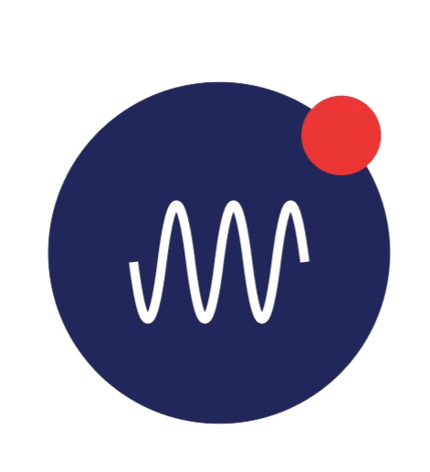

Introduction

  
  <h3 align="center"><code>@decentdotland/sender-protocol</code></h3>
  
multichain gasless notitfication protocol

============

[Sender Protocol](http://sender.gg) (previously 1notif protocol) is an OOTB (Out-Of-The-Box), gasless and immediate notification protocol. Due to the used Tech-Stack and the infrastructure architecture created by Sender Protocol, the protocol provides OOTB support to any EVM blockchain.

Tech-Stack
==========

- [Execution Machine (EXM)](https://exm.dev)
- DecentLand
	- [ARK Protocol](https://ark.decent.land)
	- [molecule.sh](https://molecule.sh)

Simplified Architecture Overview
================================

- Input Layer: web2 or web3 events (server, frontend, smart contract)
- Execution Layer: 
	- **low-level**: Sender channels (permission-less functions, smart contracts) deployed on EXM.
	- **intermediate-level**: Storage - Arweave
	- **high-level**: Sender SDK
- Output Layer: client-side (integrated channels across D/Apps)

Sender Protocol Smart Contracts
======================
## EXM Briefly:
Sender Protocol is composed of a set of smart contracts deployed on the EXM protocol. Briefly, EXM smart contracts are serverless and the final states are lazy evaluated (Lazy Evaluation), the contract state is cashed on centralized servers (EXM side with Verifiable Computing) that provide the instant finality & evaluation features of EXM protocol. [Read more about how EXM works here.](https://communitylabs.medium.com/execution-machine-explained-b6ca32d884d1)

## Sender Protocol Smart Contracts Architecture

### Channels Registry Contract (CRC): WIP
Sender resolver (CRC) is a simple name system resolver for the serverless functions deployed on EXM. We plan to use Sender resolver to create a naming system dedicated to Sender protocol channels. 

### Channels
Sender channels are smart contracts deployed by Dapps developer via Sender SDK (soon) to push notifications to a channel's `subscribers` in a gasless, immediate and onchain manner.

#### 1) x-EVM Channel
This `channel` template provides OOTB support for pushing notifications from Dapp's backends to any channel's subscriber EOA EVM address regardless of the EVM chain. check the [source-code](./contracts/source-codes/evm-channel.js) | [state](./contracts/states/evm-channel.json)

#### 2) [Arweave](https://arweave.org) Channel
Arweave `channel` smart contract is a special template for the Dapps built on the Arweave blockchain. check the [source-code](./contracts/source-codes/arweave-channel.js) | [state](./contracts/states/arweave-channel.json)

#### 3) [Solana](https://solana.com/) Channel
Solana channel smart contract is a template dedicated for Solana notification pushing. check the [source-code](./contracts/source-codes/sol-channel.js) | [state](./contracts/states/sol-channel.json)

#### 4) [Zilliqa](https://www.zilliqa.com/) Channel
Zilliqa channel smart contract is a template dedicated for Zillqa notification pushing. check the [source-code](./contracts/source-codes/zil-channel.js) | [state](./contracts/states/zil-channel.json)

#### 5) [Tron](https://tron.network/) Channel 
Tron channel smart contract is a template dedicated for Tron notification pushing. check the [source-code](./contracts/source-codes/trx-channel.js) | [state](./contracts/states/trx-channel.json)

#### 6) [Stacks](https://stacks.co/) Channel 
Stacks channel smart contract is a template dedicated for Stacks notification pushing. check the [source-code](./contracts/source-codes/stacks-channel.js) | [state](./contracts/states/stacks-channel.json)

#### 7) [Internet Computer - ICP](https://internetcomputer.org/) Channel 
ICP channel smart contract is a template dedicated for ICP notification pushing. check the [source-code](./contracts/source-codes/icp-channel.js) | [state](./contracts/states/icp-channel.json)

#### 8) [Near Blockchain](https://near.org) Channel
Due to the current molecule.sh limitations, Near channels have a different approach to push notifications. The Channel is composed of 2 parts, the user's subscription happens on a Near registry contract, and the notification pushing happens on EXM contract owned by the Channel owner. The flow is as follow:
* Subscribers would first need to register their address with the NEAR contract. This can be done by sending a transaction to the contract.
* The notification channel owner would then use the EXM contract to send notifications to the subscribers. The EXM contract can fetch the list of subscriber addresses and would be responsible for pushing the notifications to these addresses.
* When a notification is sent, the EXM contract would iterate through the list of subscriber addresses and send the notification to each address according to the notification settings.

* Subscribers would be able to opt out of receiving notifications at any time by unregistering their address from the NEAR contract.

EXM Channel can be found [here](./contracts/source-codes/near-channel.js) and Near contract template [here](./contracts/near-contracts/user-actions.ts)

Follow Us
=========
- [Twitter](https://twitter.com/1notif)

Licensing
=========
This repository is licensed under the GPL-3.0 license. [Read the license](./LICENSE)
